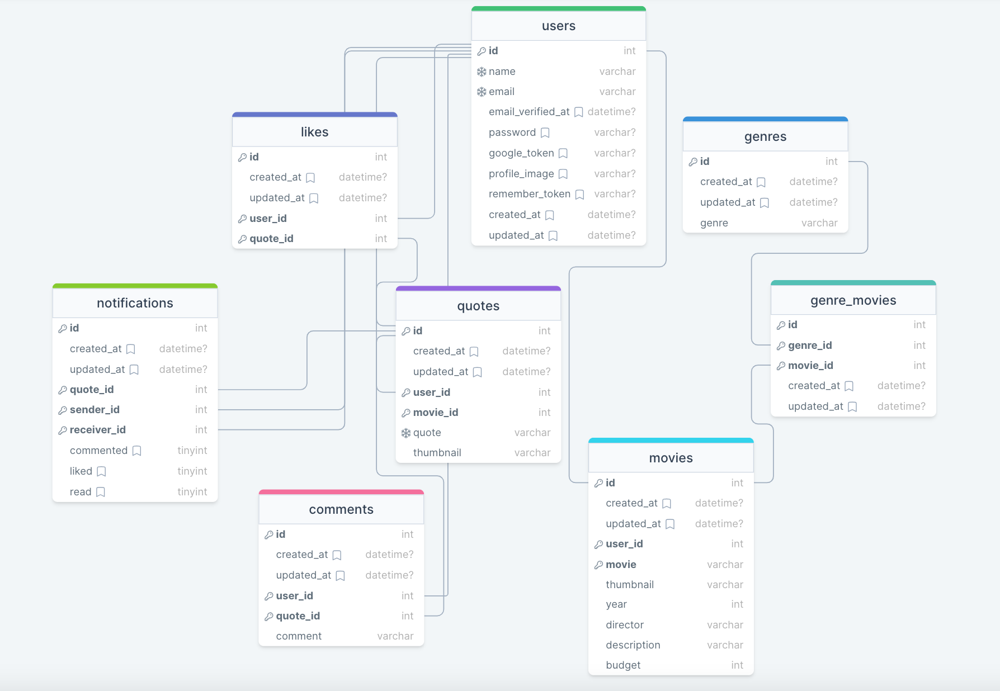

<div style="display:flex; align-items: center">
  <h1 style="position:relative; top: -6px" >Movie quotes upgraded</h1>
</div>

---
Movie quotes upgraded - is a platform where the user can register first, then authorize and view quotes from films.

#
### Table of Contents
* [Prerequisites](#prerequisites)
* [Tech Stack](#tech-stack)
* [Getting Started](#getting-started)
* [Migrations](#migration)
* [Production Server](#production-server)

#
### Prerequisites

*  *PHP*
*  *SQLITE*
*  *npm*
*  *composer*


#
### Tech Stack

*  [Laravel@10.x](https://laravel.com/docs/10.x) - back-end framework
*  [Sanctum Auth](https://laravel.com/docs/10.x/sanctum) - Stateful authentication system for SPA applications 
*  [Spatie Translatable](https://github.com/spatie/laravel-translatable) - package for translation

#
### Getting Started
First of all you need to clone E Space repository from github:
```sh
git clone https://github.com/RedberryInternship/aleqsandre-mtchedlidze-movie-quotes-back.git
```

Next step requires you to run *composer install* in order to install all the dependencies.
```sh
composer install
```

After you have installed all the PHP dependencies, it's time to install all the JS dependencies:
```sh
npm install
```

and also:
```sh
npm run dev
```
in order to build your JS/SaaS resources.

Now we need to set our env file. Go to the root of your project and execute this command.
```sh
cp .env.example .env
```
And now you should provide **.env** file all the necessary environment variables:

#
**Gmail SMPT:**
>MAIL_DRIVER=smtp

>MAIL_HOST=smtp.gmail.com

>MAIL_PORT=465

>MAIL_USERNAME=******

>MAIL_PASSWORD=******

>MAIL_ENCRYPTION=ssl

>MAIL_FROM_NAME=MovieQuotes

#
**Pusher:**
> PUSHER_APP_ID=******

> PUSHER_APP_KEY=******

> PUSHER_APP_SECRET=******

>PUSHER_HOST=

> PUSHER_PORT=443

>PUSHER_SCHEME=https

> PUSHER_APP_CLUSTER=******

> VITE_PUSHER_APP_KEY="${PUSHER_APP_KEY}"

> VITE_PUSHER_HOST="${PUSHER_HOST}"

> VITE_PUSHER_PORT="${PUSHER_PORT}"

> VITE_PUSHER_SCHEME="${PUSHER_SCHEME}"

> VITE_PUSHER_APP_CLUSTER="${PUSHER_APP_CLUSTER}"

#
**Front end communication:**
> VITE_APP_URL=http://localhost:5173

#
**Google Authentication:**
> GOOGLE_CLIENT_ID=735203897032-d45dcg9tg2flmsrkejccntmnmkuaia7q.apps.googleusercontent.com

> GOOGLE_CLIENT_SECRET=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

after setting up **.env** file, execute:
```sh
php artisan config:cache
```
in order to cache environment variables.

Now execute in the root of you project following:
```sh
php artisan key:generate
```
Which generates auth key.

##### Now, you should be good to go!


#
### Migration
if you've completed getting started section, then migrating database if fairly simple process, just execute:

```sh
touch database/database.sqlite 
```

Now migrate:
```sh
php artisan migrate
```

#
### Development

You can run Laravel's built-in development server by executing:

```sh
php artisan serve
```

when working on JS you may run:

```sh
npm run dev
```
it builds your js files into executable scripts.
If you want to watch files during development, execute instead:

```sh
npm run watch
```
it will watch JS files and on change it'll rebuild them, so you don't have to manually build them.


Then everything should be OK :pray:

[Database Design Diagram](./readme/assets/diagram.png)



[Swagger API endpoints](https://movie-quotes-back.aleqsandre-mchedlidze.redberryinternship.ge/swagger "API")


#
### Production Server

Movie quotes upgraded application is hosted on following <a href="https://movie-quotes-back.aleqsandre-mchedlidze.redberryinternship.ge">URL</a>
<br />
Front end application is hosted on following <a href="https://movie-quotes-front.aleqsandre-mchedlidze.redberryinternship.ge">URL</a>

